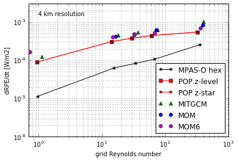

# Overview
## Motivation

- Understand the numerical accuracy of different:
    - remapping schemes
    - advection schemes
    - vertical coordinates
- Evaluate MOM6?

## Reference (background) potential energy

- The lowest potential energy state of a fluid
    - Adiabatically resort to a stratified state
- Should be constant in an unforced model with closed boundaries
    - Increased by mixing; centre of mass is raised

$$ \mathrm{RPE} = g \int_\Omega z \rho^*(z)\,\mathrm dV$$

- *Gives no localised information*

## Looking at a timestep

- MOM6 is a generalised vertical coordinate model (ALE)
    - Clear distinction between along- and across-coordinate dynamics
- Take differences in RPE from different parts of a timestep to determine their contribution
    - $\Delta \mathrm{RPE}_\text{adv} = \mathrm{RPE}_\text{post adv} - \mathrm{RPE}_\text{pre adv}$
    - $\Delta \mathrm{RPE}_\text{ale} = \mathrm{RPE}_\text{post ale} - \mathrm{RPE}_\text{pre ale}$

# Experiments
## Overview

- We follow experiments from Ilicak et al. (2012) and Petersen et al. (2015):
    - Lock exchange (dam break)
    - Overflow (downslope flow)
    - Internal gravity waves
    - Baroclinic eddies
- Spurious mixing is investigated as a function of the grid Reynolds number:

$$\mathrm{Re}_\Delta = \frac{U\Delta x}{\nu_h}$$

# Overflow
## Low viscosity

## High viscosity

## Low viscosity (sigma)

## High viscosity (sigma)

* * *

# Baroclinic eddies
* * *

* * *

* * *

* * *

# Internal waves
* * *

* * *

* * *

## Discussion
- High-order advection schemes?
- The effect of CFL number (edge differencing)
- Coordinate choices

* * *

