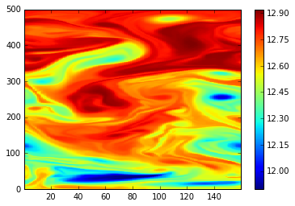
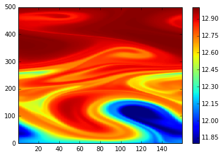
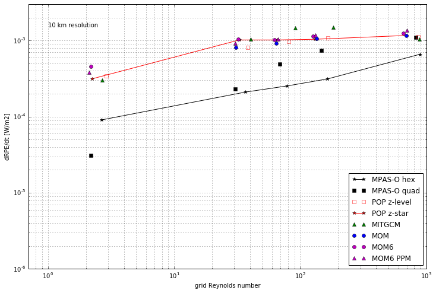
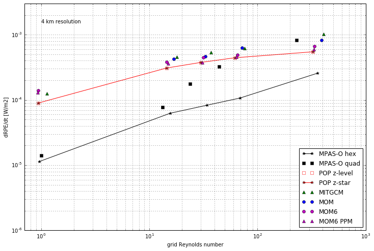
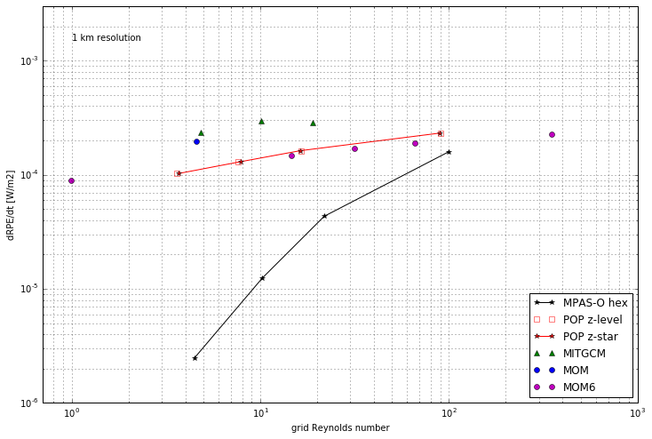
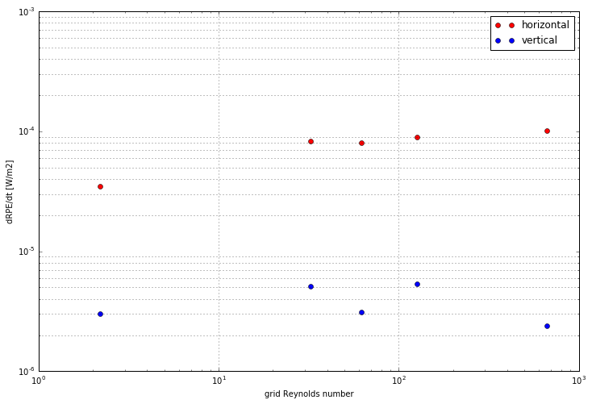
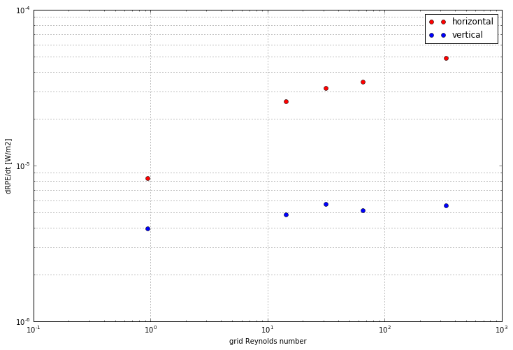
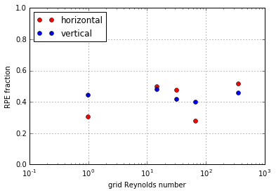

## Baroclinic eddies

The previous two test cases were only two-dimensional, and therefore couldn't incorporate the influence of the Coriolis force. We now introduce a test case that involves a baroclinically unstable temperature front in a periodic channel with rotation. This test case was presented by @ilicak12, as the baroclinically unstable front quickly leads to vigorous eddying without either mechanical or buoyancy forcing, thus it is a closed system suitable for analysis by changes in RPE. The domain is a periodic channel \SI{160}{\kilo\metre} wide by \SI{500}{\kilo\metre} long, with a depth of \SI{1000}{\metre}. The front has a sinusoidal meridional position, defined as

$$y_w(x) = y_0 - y_A \sin\left(2\pi k \frac{x}{L_x}\right),$$

where $y_A = \SI{40}{\kilo\metre}$ is the amplitude, $y_0 = \SI{250}{\kilo\metre}$ is the centre of the domain, $k = 3$ and $L_x = \SI{160}{\kilo\metre}$ ensure that three wavelengths span the width of the domain. The temperature distribution in the domain is given by

\resizebox{\hsize}{!}{$\Theta(x,y,z) = \begin{cases}
\Theta_0(z) & y \ge y_w(x) + \Delta y, \\
\Theta_0(z) - \Delta \Theta \left(1 - \frac{y - y_w(x)}{\Delta y}\right) & y_w < y < y_w + \Delta y, \\
\Theta_0(z) - \Delta \Theta & y \le y_w(x),\end{cases}$}

where $\Theta_0(z)$ is a linearly stratified background between \SI{10.1}{\celsius} and \SI{13.1}{\celsius}, $\Delta y = \SI{40}{\kilo\metre}$ is the width of the front and $\Delta \Theta = \SI{1.2}{\celsius}$ is the temperature difference across the front. Additionally, a temperature perturbation is added to the crest of one of the waves to promote instability. The region over which the perturbation is added is bounded by $x_2 \le x \le x_3$ and $y'_w - \Delta y / 2 \le y \le y'_w + \Delta y / 2$, where

$$y'_w(x) = y_0 - \frac{y_A}{2}\sin\left(\pi \frac{x - x_2}{x_3 - x_2}\right).$$

<!--

-->

The perturbation itself is defined by the temperature anomaly

$$\Theta'(x,y) = \Delta\Theta'\left(1 - \frac{y - y'_w(x)}{\Delta y / 2}\right)$$

In order to encourage baroclinicity, a quadratic bottom drag with drag coefficient $C_D = 0.01$ is used. Experiments were performed at horizontal resolutions of \SIlist{1;4;10}{\kilo\metre}. For each choice of horizontal resolution, the horizontal viscosities $\nu_h$ were \SIlist{1;5;10;20;200}{\square\metre\per\second}, giving a range of lateral grid Reynolds numbers from $O(1)$ at the highest viscosity, through to $O(1000)$ for the lowest viscosity.

\Cref{fig:snapshot1,fig:snapshot200} show the surface temperature after the full 320 days of simulation at 1km horizontal resolution, at the lowest and highest viscosity, respectively. In the low viscosity case, strong spurious mixing has occurred, but finer-scale features are also evident. Conversely, the range of intermediate temperatures is significantly less with a higher horizontal viscosity, but the eddies are much weaker due to the momentum damping by the viscosity.

<!--  -->

\Cref{fig:drpe_10,fig:drpe_4,fig:drpe_1} show the rate of RPE change across all tested models for \SIlist{10;4;1}{\kilo\metre} horizontal resolution, respectively. In the 10km experiment, the two available tracer advection schemes were used, PLM shown in magenta circles and the higher-order PPM:H3 scheme in magenta triangles. In the spurious mixing saturation regime of $\mathrm{Re}_\Delta > 10$, MOM6 with the PLM scheme plateaus at a very similar level to MOM and POP. As expected, the PPM:H3 scheme exhibits slightly lower spurious mixing, especially at the lowest grid Reynolds number. However, in the saturation regime the spurious mixing continues to rise slightly with increasing grid Reynolds number, exceeding the PLM scheme.

<!--  -->

When the horizontal resolution is decreased to 4km, MOM6 exhibits slightly greater spurious mixing than POP across the range of experiments. At this resolution, the PPM:H3 advection scheme consistently provides a small decrease in spurious mixing as compared to the PLM scheme. However, the improvement in spurious mixing is minor, and may not be worth the extra computational cost involved in invoking the PPM:H3 advection scheme.

<!--  -->

### Spurious mixing orientation

We consider the orientation of spurious mixing at each of the tested horizontal resolutions in \cref{fig:split_10,fig:split_4,fig:split_1}. As horizontal resolution increases (grid spacing decreases), the fraction of spurious mixing by regridding/remapping increases. Indeed, at 1km horizontal resolution, horizontal tracer advection and regridding/remapping contribute approximately equally to the total spurious mixing.
