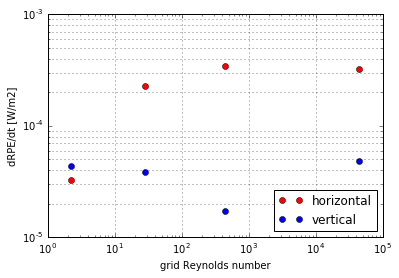

---
classoption: twocolumn
...

## Internal Waves

The breaking of internal waves in the ocean is a significant source of abyssal mixing, and thus is an important process contributing to the abyssal ocean circulation (Nikurashin & Ferrari, 2013). Spurious mixing due to internal waves depends strongly on the choice of vertical coordinate. The propagation of linear internal waves produces vertical mixing in ocean models with a fixed vertical grid such as z-star (Gouillon, 2010). However, other coordinates, such as z-tilde, permit layers to move with the waves, thereby restricting transport between layers and reducing spurious mixing.

This test case has a linearly stratified background temperature distribution in a domain 500m deep and 250km wide. Horizontal grid spacing is 5km, and the vertical grid spacing $\Delta z$ is 25m. A wave perturbation is superimposed, lifting the isopycnals in the centre of the domain to set up counter-propagating internal waves towards the left and right horizontal boundaries. The background temperature distribution is defined as

$$\Theta_0(z) = \Theta_\text{bot} + (\Theta_\text{top} - \Theta_\text{bot})\frac{z_\text{bot} - z}{z_\text{bot}},$$

where $\Theta_\text{bot} = 10.1\,^\circ\mathrm{C}$, $\Theta_\text{top} = 20.1\,^\circ\mathrm{C}$, and $z_\text{bot} = -487.5\,\mathrm{m}$. The wave perturbation,

$$\Theta'(x,z) = -A\cos\left(\frac{\pi}{2L}(x - x_0)\right) \sin\left(\pi\frac{z + \Delta z/2}{z_\text{bot} + \Delta z/2}\right),$$

is added in the region $x_0 - L < x < x_0 + L$, where $L = 50\,\mathrm{km}$, $x_0 = 125\,\mathrm{km}$. The perturbation amplitude is $A = 2\,^\circ\mathrm{C}$, matching the high-amplitude case of Ilicak et al. (2012), and is the only case presented by Petersen et al. (2015). The waves set up by this perturbation have a period of approximately one day, so the test case is run for 100 days to allow the waves to propagate many times across the full extent of the domain.

Considering the average rate of RPE change (Figure \ref{fig:drpe}), MOM6 performs well for each of the chosen vertical coordinates; z-star, z-tilde and continuous isopycnal (rho). This is likely due to its implementation as a layered model while ALE is applied. In this configuration, vertical layers are able to move freely within their column as waves pass through. During horizontal advection, there is exactly zero transport through vertical interfaces, so mixing occurs only laterally through a mostly isopycnal layer. The vertical coordinate becomes more isopycnal with the z-tilde and rho coordinates, thus regridding causes smaller displacement of the interfaces. Subsequently, there is less vertical transport due to remapping and the overall spurious mixing is reduced.

The implementation of the z-tilde coordinate differs between MOM6 and MPAS-O. The filter timescale $\tau_{Dlf}$ in MPAS-O defines the cutoff above which frequencies are treated in a Lagrangian manner. As MOM6 is a layered model, all motion is Lagrangian during a single timestep. The only controllable parameter in the MOM6 implementation of z-tilde is $\tau_{hhf}$, which defines the relaxation timescale of the grid, to prevent long-term drift. We set this to 30 days to match the configuration used for MPAS-O. MOM6 exhibits only a modest improvement over MPAS-O here, since most dynamically interesting scales are already captured by the 100 day Lagrangian timescale used by MPAS-O.

### Spurious mixing orientation

We take the z-star configuration of MOM6 (shown in magenta in Figure \ref{fig:drpe}) and compute the orientation of the spurious mixing. When $\mathrm{Re}_\Delta < 10$, the horizontal component is smaller than the vertical. This is consistent with the conclusion of Ilicak et al. (2012), that the grid Reynolds number must be below 10 to avoid the saturation level of spurious mixing. In this regime, the vertical configuration such as coordinate or reconstruction accuracy can have a significant imapct on the overall spurious mixing. There's a minimum in the vertical contribution at $\nu_h = 1\,\mathrm{m}^2\mathrm{s}^{-1}$, corresponding to $\mathrm{Re}_\Delta \approx 400.

Figure \ref{fig:tildesplit} shows the relative contributions to the total RPE rate of change by the horizontal and vertical components. There is once again a minimum in the contribution by the vertical component at $\nu_h = 1$, corresponding to $\mathrm{Re}_\Delta \approx 450$.

### Other things?
- Not sure what else to say about the split results
- Explanation/exploration of continuous isopycnal coordinate
- Poor behaviour of PLM remapping? -- importance of sufficiently high-order remapping scheme
    - We've kind of mentioned that it's a vertically dominated test case
- Say something about the significance of results