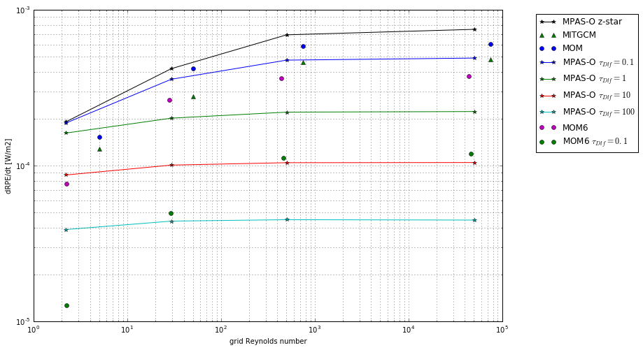
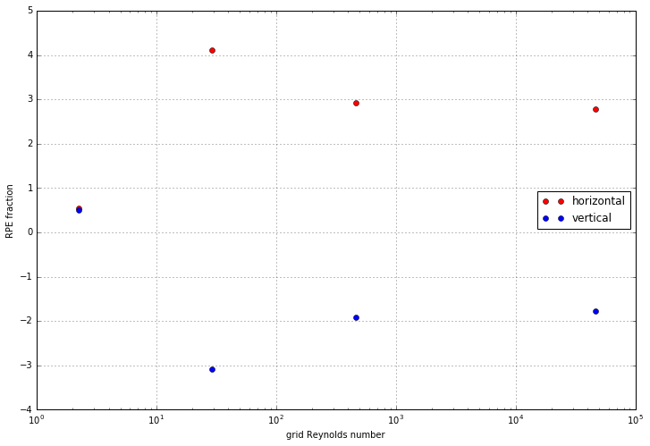

---
classoption: twocolumn
...

## Internal Waves

This test has a linearly stratified background temperature distribution

$$\Theta_0(z) = \Theta_\text{bot} + (\Theta_\text{top} - \Theta_\text{bot})\frac{z_\text{bot} - z}{z_\text{bot}},$$

upon which a wave is superimposed

$$\Theta'(x,z) = -A\cos\left(\frac{\pi}{2L}(x - x_0)\right) \sin\left(\pi\frac{z + \Delta z/2}{z_\text{bot} + \Delta z/2}\right)$$

### The z-tilde vertical coordinate

There are two broad implementations of the ALE algorithm; quasi-Eulerian and quasi-Lagrangian. In quasi-Eulerian models, such as MPAS-Ocean, ALE is achieved through a non-physical vertical velocity to redistribute mass between levels. MOM6, on the other hand, is a quasi-Lagrangian model with a purely numerical ALE implementation, known as regridding/remapping. The regridding step involves explicitly moving interfaces between layers according to the chosen vertical coordinate. The changes in mass/concentration between cells is then adjusted through remapping, a conservative algorithm that uses sub-grid reconstructions within a column.

The full z-tilde vertical coordinate includes a distinction between high- and low-frequency dynamics. Because MOM6 is a quasi-Lagrangian model, there's no need to encode the high-frequency Lagrangian dynamics into the coordinate; they're explicitly resolved by the model. This gives only one parameter controlling the coordinate, which is the low-frequency restoring timescale. In MOM6, this parameter simply governs the restoration of the model grid toward the specified z-star grid (in this case, a vertically uniform grid).

Using the z-tilde vertical coordinate provides a significant improvement in the average rate of RPE change across the internal waves test. This is because the vertical grid is allowed to align with isothermic surfaces, thus along-layer advection includes a smaller diapycnal component, reducing spurious mixing.

### *Points to make*
- Section introduction (motivation?)
- Low grid Reynolds number behaviour (not a flat distribution as seen in other models)
- Significant improvement using z-tilde
- Crossing of vertical/horizontal at low grid Reynolds number
- Strongly negative dRPE/dt when using z-tilde
- Implementation of z-tilde in MOM6
- Poor behaviour of PLM remapping? -- importance of sufficiently high-order remapping scheme
