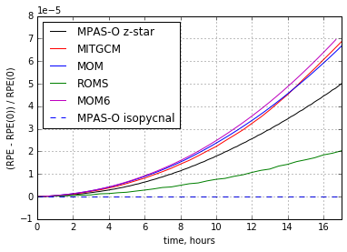
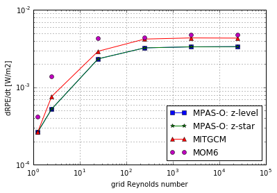
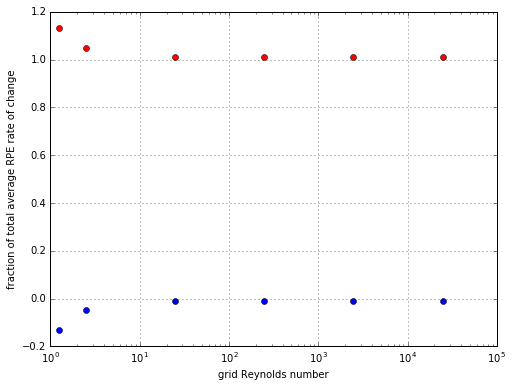

---
classoption: twocolumn
...

## Lock Exchange

The lock exchange test case is a simple configuration that shows the creation of intermediate densities by spurious mixing. This is a replication of one of the test cases presented by Ilicak et al. (2012). The test case takes place in a two-dimensional domain of 64km width and 20m depth. Only the highest resolution test cases are chosen, with horizontal and vertical grid spacings of $\Delta x = 500\,\mathrm{m}$ and $\Delta z = 1\,\mathrm{m}$, respectively. The lock exchange is defined by an initial temperature distribution comprised of one density class on each side of the domain,

- mention colours, axis labels, mention that intermediate densities are all spuriously mixed

$$\Theta(x) = \begin{cases}
5 & x < 32\text{ km}\\
30 & x \ge 32\text{ km}\end{cases}.$$

This case is equivalent to two adjacent basins, each at constant temperature, with a dam between them that is removed at $T=0$. The warm water from the right basin flows from right-to-left above cold water, while conversely cold water from the left basin flows underneath the warm water from left-to-right. This is simply a gravity current, for which we have a theoretical prediction for the front velocity in a rectangular channel, given by

$$u_f = \frac12 \sqrt{gH \rho'}$$

When calculating the grid Reynolds number, the theoretical front velocity is used instead of the actual mean velocity over the domain. All runs were carried out for 17 hours using a baroclinic timestep that satisfied CFL conditions across the range of horizontal viscosities ($\nu_h = 0.01, 0.1, 1, 10, 100, 200\,\text{m}^2\text{s}^{-1}$).

- make it clear that this uses Petersen's data

The time series of normalised RPE in Figure \ref{fig:rpenorm} shows MOM6 having a similar shape to MitGCM and MOM5. However, the curve steepens with time, suggesting that more spurious mixing is occurring in MOM6.

Above a grid Reynolds number of 10, MOM6 performs similarly to the other models shown in Figure \ref{fig:drpe}. At this point, the models are running above the threshold for saturation of spurious mixing. However, in the regime where spurious mixing isn't saturated, MOM6 exhibits a somewhat higher RPE rate of change. This suggests that spurious mixing in MOM6 is due to tracer advection, as viscosity is sufficient to damp grid-scale noise in the velocity field.

### Advection order

One aspect of model configuration that may significantly affect spurious mixing is the order of accuracy of the tracer advection scheme. A higher-order advection scheme purports to reduce the spurious mixing in advection, at the cost of runtime performance. Curiously, the two advection schemes in MOM6, PLM (piecewise linear) and PPM:H3 (Huynh third order piecewise parabolic), exhibit nearly identical spurious mixing. In order to preserve the pre-existing range of density classes by avoiding the creation of spurious minima or maxima, advection schemes may employ limiters. In MOM6, the limiting scheme reduces to a first-order upstream method. The minimal difference in spurious mixing despite an improved advection scheme implies that advection may be dominated by a limiter at the front, where spurious mixing is most vigorous.

### Directional split

Figure \ref{fig:rpesplit} shows that the mixing is predominantly due to horizontal processes. Indeed, for all of the experiments, the average RPE change due to regridding/remapping is actually negative. Physically, this means that regridding/remapping tends to slightly lower the centre of mass of the domain, counteracting some of the mixing due to the advection scheme.

From a physical viewpoint, we expect RPE to be an increasing quantity. However, Figure \ref{fig:rpesplit} shows that the vertical process of regridding/remapping causes a small RPE decrease in these experiments. We illustrate a simple example that demonstrates how the combination of regridding/remapping may create a decrease in total potential energy. For a single column case, this is equivalent to the RPE, assuming no density inversions.

**move this section to theory**

Figure \ref{fig:schematic} shows a simple two-cell domain under regridding/remapping. The bottom cell has a mean tracer concentration of $\phi_1$ and thickness $h_1$. Similarly, the top cell has a mean tracer concentration of $\phi_2$ and thickness $h_2$. Regridding moves the interface between the cells from its initial position at $z = h_1$ to the dashed line at $z = h_1 - \Delta h$, and remapping mixes the integrated quantity of tracer $\phi'$ from the right cell to the left cell. Initially, the potential energy of the domain is

$$PE_i = \frac{\phi_1 h_1 h_1}{2} + \phi_2 h_2\left(h_1 + \frac{h_2}{2}\right).$$

After remapping, the potential energy becomes

$$PE_f = \left(\phi_1 h_1 - \phi'\right)\frac{h_1 - \Delta h}{2} + \left(\phi' + \phi_2 h_2\right)\left(h_1 - \Delta h + \frac{h_2 + \Delta h}{2}\right).$$

Taking the difference between the final and initial potential energy gives the RPE change due to regridding/remapping,

$$PE_f - PE_i = \frac{\phi'\left(h_1 + h_2\right)}{2} - \frac{\Delta h\left(\phi_1 h_1 + \phi_2 h_2\right)}{2}.$$

With the condition that $\phi_1 > \phi_2$, it is possible for $PE_f - PE_i < 0$ when the remapping is higher order than piecewise constant (PCM). PCM is the lowest order reconstruction, and gives $\phi' = \phi_1 \Delta h$, thus $PE_f - PE_i \ge 0$.
